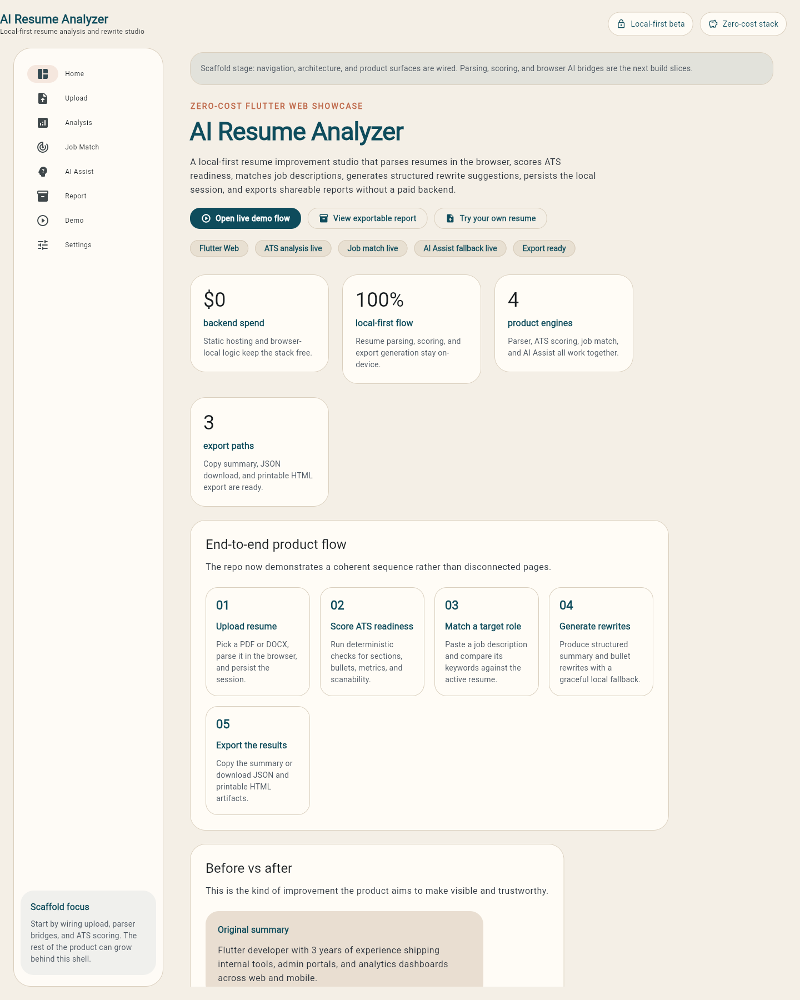
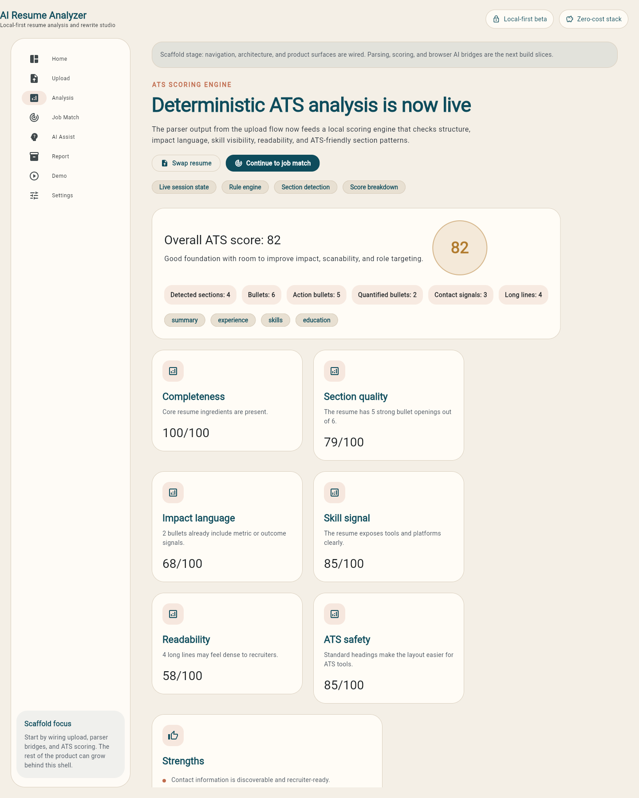
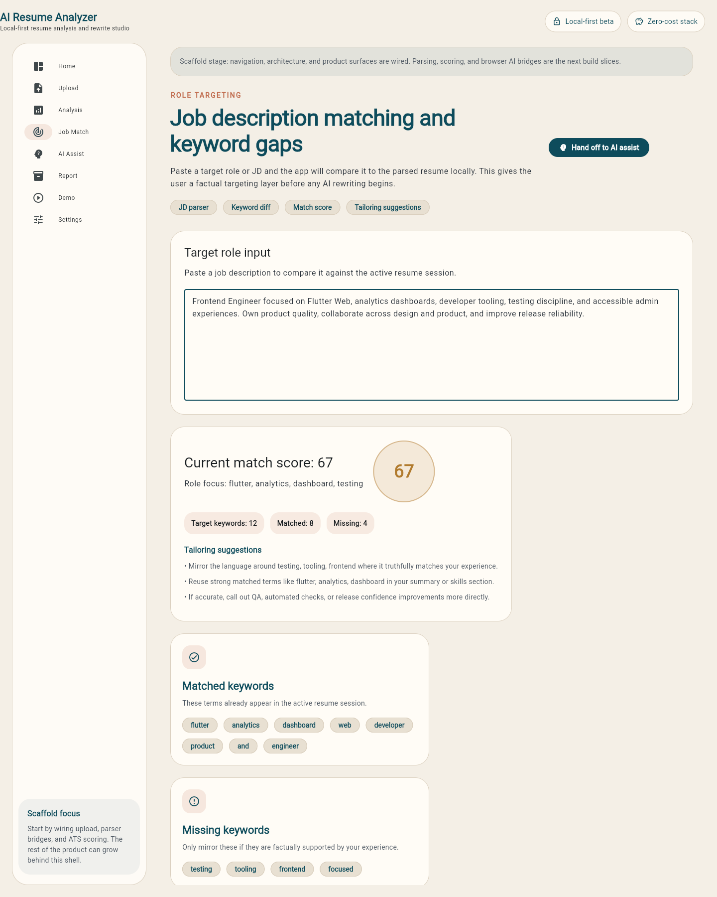
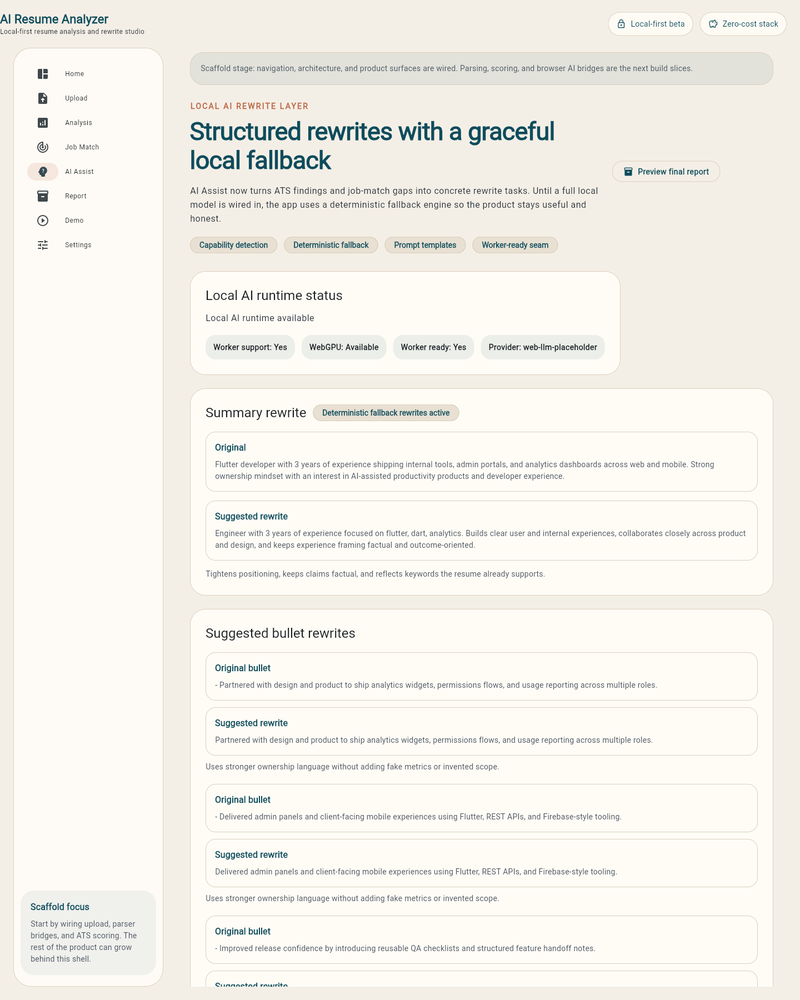
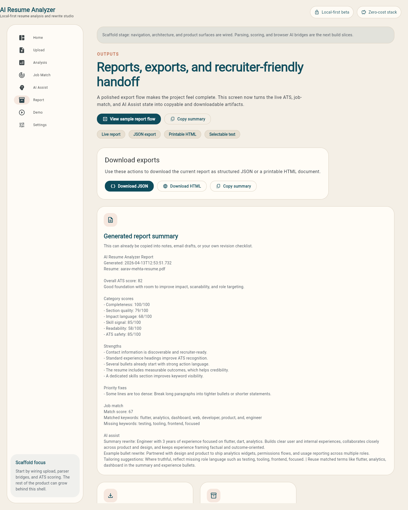

# AI Resume Analyzer

Local-first Flutter Web showcase for parsing resumes in the browser, scoring ATS readiness, matching job descriptions, generating structured rewrite suggestions, persisting local sessions, and exporting recruiter-friendly reports.

## What it already does

- Parse `PDF` resumes in-browser with `PDF.js`
- Parse `DOCX` resumes in-browser with `Mammoth.js`
- Run deterministic ATS scoring on structure, bullets, metrics, and scanability
- Compare a resume against a pasted job description and surface keyword gaps
- Generate structured summary and bullet rewrites with a graceful local fallback
- Persist the active resume and job description locally in the browser
- Export the current report as copyable text, `JSON`, or printable `HTML`

## Why this project works as a portfolio piece

- Zero-cost architecture: no paid hosting, no paid inference API, no backend required for `v1`
- Privacy-first story: resume files can stay on the user device
- Strong engineering signal: Flutter Web UI, browser interop, deterministic scoring, product state, AI seams, and deployment workflow

## Stack

```text
Flutter Web UI
  -> PDF.js / Mammoth.js bridges
  -> Resume normalization layer
  -> ATS rule engine
  -> Job match engine
  -> AI Assist fallback + WebLLM seam
  -> Local browser persistence
  -> JSON / HTML report export
```

The deterministic ATS engine is the core product. Browser AI is an enhancement layer for rewriting and tailoring, not the source of truth for scoring.

## Project structure

- `lib/app`
  - app bootstrap, theme, router
- `lib/core`
  - shared models, widgets, storage, constants
- `lib/features/upload`
  - file intake, parser bridge boundary, session state
- `lib/features/analysis`
  - ATS scoring engine and analysis UI
- `lib/features/job_match`
  - job description parsing, matching, and tailoring suggestions
- `lib/features/ai_assist`
  - runtime capability detection and structured rewrite planning
- `lib/features/report`
  - export bundle builder and report downloads
- `web/js`
  - browser-specific parser and AI bridge files

## Run locally

```bash
flutter pub get
flutter run -d chrome
```

## Build for web

```bash
flutter build web
```

The generated build output lands in `build/web`.

## Screenshots

Generated demo captures from the built Flutter Web app:











To refresh the gallery after a new web build:

```bash
python3 -m http.server 8123 --bind 127.0.0.1 -d build/web
npm run capture:screenshots
```

## Deploy to GitHub Pages

This repo includes a GitHub Actions workflow at [.github/workflows/deploy-pages.yml](.github/workflows/deploy-pages.yml).

1. Push this repo to your personal GitHub account.
2. In repository settings, open `Pages`.
3. Set `Source` to `GitHub Actions`.
4. Push to `main` and let the workflow build and deploy the app.

The workflow:

- runs `flutter analyze`
- runs `flutter test`
- builds Flutter Web
- auto-detects the correct `--base-href`
- deploys to GitHub Pages

Publishing notes are in [docs/publish.md](docs/publish.md).

## Personal GitHub separation

If you are using a company-managed GitHub account on the same machine, keep this repo isolated with:

- a personal SSH key
- a personal SSH host alias
- repo-local `git config user.name`
- repo-local `git config user.email`

See [docs/publish.md](docs/publish.md) for the exact setup.

## Verification

Current validation commands:

```bash
flutter analyze
flutter test
flutter build web
```

## Next upgrades

1. Replace the AI fallback seam with a real local WebLLM worker
2. Add accepted rewrite state and side-by-side diffing
3. Capture a short demo GIF for the repo front page
